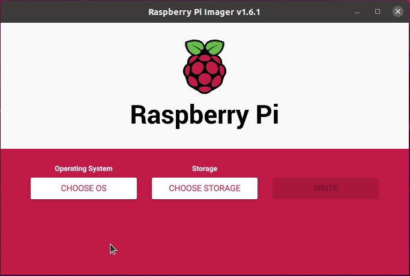
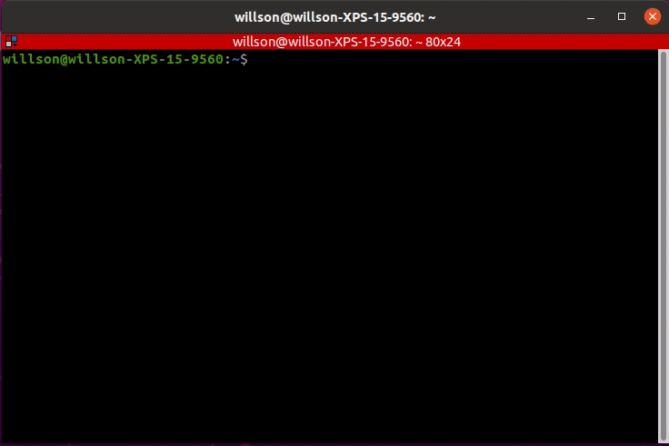
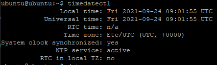
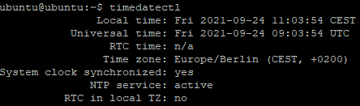

# Raspberry Pi 3B+ Setup
Reference [Turtlebot3 Emanual](https://emanual.robotis.com/docs/en/platform/turtlebot3/sbc_setup/#sbc-setup)
1. Download the proper [*Ubuntu 20.04.1(Focal) Preinstalled Server image*](http://cdimage.ubuntu.com/ubuntu-server/focal/daily-preinstalled/current/) or [*Ubuntu 20.04 Server 64-Bit*](https://ubuntu.com/download/raspberry-pi) on your PC.
2. Extract the downloaded file.
3. [Download Raspberry Pi Imager from raspberrypi.org](https://www.raspberrypi.org/software/) or `snap install rpi-imager`



    * Click CHOOSE OS.
    * Click Use custom and select the extracted .img file from local disk.
    * Click CHOOSE STORAGE and select the microSD.
    * Click WRITE to start burning the image.

4. Boot Up the Raspberry Pi
    * Connect the HDMI cable of the monitor to the HDMI port of Raspberry Pi.
    * Connect input devices to the USB port of Raspberry Pi.
    * Insert the microSD card.
    * Connect the power (either with USB or OpenCR) to turn on the Raspberry Pi.
5. Configure the Raspberry Pi
    * Log in with default username(*ubuntu*) and password(*ubuntu*). After logged in, system will ask you to change the password.
    * Open automatic update setting file.
    ```
    $ sudo nano /etc/apt/apt.conf.d/20auto-upgrades
    ```
6. Change the update settings as below.
    ```
    APT::Periodic::Update-Package-Lists "0";
    APT::Periodic::Unattended-Upgrade "0";
    ```
    * Save the file with *Ctrl+S* and exit with *Ctrl+X*.
7. Enter below command to configure the WiFi network setting.
    ```
    $ sudo nano /etc/netplan/50-cloud-init.yaml
    ```
8. When the editor is opened, append below contents at the end of the file.
    Replace the **WIFI_SSID** and **WIFI_PASSWORD** with your wifi SSID and password.
    
    

    Save the file with *Ctrl+S* and exit with *Ctrl+X*.

    

    ```
    # My Turtlebot3 Network Configuration
    network:
        version: 2
        renderer: networkd
        ethernets:
        eth0:
            dhcp4: yes
            dhcp6: yes
            optional: true
        wifis:
        wlan0:
            dhcp4: no
            dhcp6: yes
            addresses: [192.168.1.xxx/24]
            gateway4: 192.168.1.1
            nameservers:
                addresses: [8.8.8.8, 1.1.1.1] #Google DNS
            access-points:
            ROS-I Academy:                      # SSID
                password: "my-connection-password"
    ```
    * *Time and Date Synchronization*: 
    ```
    $ systemctl unmask systemd-timesyncd.service
    $ systemctl restart systemd-timsyncd.service
    $ timedatectl
    ```
    This should display the proper time. 

    

    If timezone is not selected properly then select your timezone using
    ```
    $ timedatectl list-timezones
    $ timedatectl set-timezone Europe/Berlin
    ```

    

9. Reboot the Raspberry Pi.
    `sudo reboot`
10. Set the *systemd* to prevent boot-up delay even if there is no network at startup. Run the command below to set mask the *systemd* process using the following command.
    ```
    $ systemctl mask systemd-networkd-wait-online.service
    ```
11. Disable Suspend and Hibernation
    ```
    $ sudo systemctl mask sleep.target suspend.target hibernate.target hybrid-sleep.target
    ```
12. After rebooting the Raspberry Pi, if you wish to work from the Remote PC using SSH, use below command from the remote PC terminal. The default password is **ubuntu**.
    ```
    $ ssh ubuntu@{IP Address of Raspberry PI}
    ```
13. Install ROS Noetic or Foxy Enter below commands to the terminal one at a time.
    * **Noetic**
    ```
    $ sudo apt-get update
    $ sudo apt-get upgrade
    $ wget https://raw.githubusercontent.com/ROBOTIS-GIT/robotis_tools/master/install_ros_noetic_rpi.sh
    $ chmod 755 ./install_ros_noetic_rpi.sh
    $ bash ./install_ros_noetic_rpi.sh
    ```
    * **Foxy**
    ```
    $ sudo apt update
    $ wget https://raw.githubusercontent.com/ROBOTIS-GIT/robotis_tools/master/install_ros2_foxy_rpi.sh
    $ chmod 755 ./install_ros2_foxy_rpi.sh
    $ bash ./install_ros2_foxy_rpi.sh
    ```
14. Install and Build ROS Packages.
    * **Noetic**
    ```
    $ sudo apt install ros-noetic-rosserial-python ros-noetic-tf
    $ mkdir -p ~/catkin_ws/src && cd ~/catkin_ws/src
    $ sudo apt install ros-noetic-hls-lfcd-lds-driver
    $ sudo apt install ros-noetic-turtlebot3-msgs
    $ sudo apt install ros-noetic-dynamixel-sdk
    $ git clone -b noetic-devel https://github.com/ROBOTIS-GIT/turtlebot3.git
    $ cd ~/catkin_ws/src/turtlebot3
    $ rm -r turtlebot3_description/ turtlebot3_teleop/ turtlebot3_navigation/ turtlebot3_slam/ turtlebot3_example/
    $ cd ~/catkin_ws/
    $ echo 'source /opt/ros/noetic/setup.bash' >> ~/.bashrc
    $ source ~/.bashrc
    $ cd ~/catkin_ws && catkin_make -j1
    $ echo 'source ~/catkin_ws/devel/setup.bash' >> ~/.bashrc
    $ source ~/.bashrc
    ```
    * **Foxy**
    ```
    $ sudo apt install python3-argcomplete python3-colcon-common-extensions libboost-system-dev build-essential
    $ sudo apt install ros-foxy-hls-lfcd-lds-driver
    $ sudo apt install ros-foxy-turtlebot3-msgs
    $ sudo apt install ros-foxy-dynamixel-sdk
    $ mkdir -p ~/turtlebot3_ws/src && cd ~/turtlebot3_ws/src
    $ git clone -b foxy-devel https://github.com/ROBOTIS-GIT/turtlebot3.git
    $ cd ~/turtlebot3_ws/src/turtlebot3
    $ rm -r turtlebot3_cartographer turtlebot3_navigation2
    $ cd ~/turtlebot3_ws/
    $ echo 'source /opt/ros/foxy/setup.bash' >> ~/.bashrc
    $ source ~/.bashrc
    $ colcon build --symlink-install --parallel-workers 1
    $ echo 'source ~/turtlebot3_ws/install/setup.bash' >> ~/.bashrc
    $ source ~/.bashrc
    ```

    * **Galactic**
    ```
    $ sudo apt install python3-argcomplete python3-colcon-common-extensions libboost-system-dev build-essential
    $ sudo apt install ros-galactic-hls-lfcd-lds-driver
    $ sudo apt install ros-galactic-turtlebot3-msgs
    $ sudo apt install ros-galactic-dynamixel-sdk
    $ mkdir -p ~/turtlebot3_ws/src && cd ~/turtlebot3_ws/src
    $ git clone -b galactic-devel https://github.com/ROBOTIS-GIT/turtlebot3.git
    $ cd ~/turtlebot3_ws/src/turtlebot3
    $ rm -r turtlebot3_cartographer turtlebot3_navigation2
    $ cd ~/turtlebot3_ws/
    $ echo 'source /opt/ros/foxy/setup.bash' >> ~/.bashrc
    $ source ~/.bashrc
    $ colcon build --symlink-install --parallel-workers 1
    $ echo 'source ~/turtlebot3_ws/install/setup.bash' >> ~/.bashrc
    $ source ~/.bashrc
    ```
15. USB Port Setting
    * **Noetic**
    ```
    $ rosrun turtlebot3_bringup create_udev_rules
    ```
    * **Foxy**
    ```
    $ sudo cp `ros2 pkg prefix turtlebot3_bringup`/share/turtlebot3_bringup/script/99-turtlebot3-cdc.rules /etc/udev/rules.d/
    $ sudo udevadm control --reload-rules
    $ sudo udevadm trigger
    ```
    * **Galactic**
    ```
    $ sudo cp `ros2 pkg prefix turtlebot3_bringup`/share/turtlebot3_bringup/script/99-turtlebot3-cdc.rules /etc/udev/rules.d/
    $ sudo udevadm control --reload-rules
    $ sudo udevadm trigger
    ```
## Final steps version specific
### Noetic
1. ROS Network Configuration Confirm the WiFi IP address and edit the .bashrc file
    ```
    $ nano ~/.bashrc
    ```
2. Modify the IP adddresses of **ROS_MASTER_URI** and the **ROS_HOSTNAME**.
    ```
    export ROS_MASTER_URI=http://{IP_ADDRESS_OF_REMOTE_PC}:11311
    export ROS_HOSTNAME={IP_ADDRESS_OF_RASPBERRY_PI_3}
    ```
3. Save the file and exit the nano editor.
4. Apply changes with the command below.
    ```
    $ source ~/.bashrc
    ```
### Foxy
1. ROS Domain ID Setting In ROS2 DDS communication, **ROS_DOMAIN_ID** must be matched between *Remote PC* and *TurtleBot3* for communication under the same network environment. Following commands shows how to assign a **ROS_DOMAIN_ID** to SBC in TurtleBot3.
    * A default ID of *TurtleBot3* is **30**.
    * Configuring the **ROS_DOMAIN_ID** of Remote PC and SBC in TurtleBot3 to **30** is recommended.
    ```
    $ echo 'export ROS_DOMAIN_ID=30 #TURTLEBOT3' >> ~/.bashrc
    $ source ~/.bashrc
    ```
**WARNING : Do not use an identical ROS_DOMAIN_ID with others in the same network. It will cause a conflict of communication between users under the same network environment.**